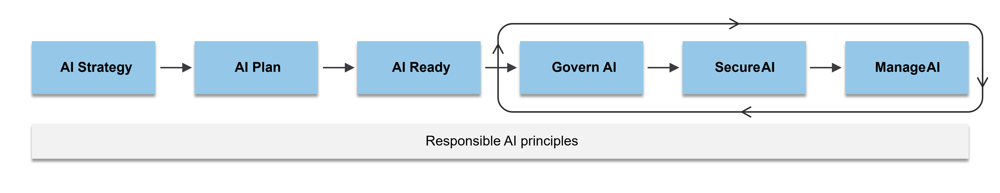
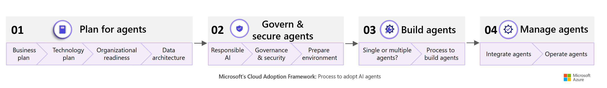

# Roles & Responsiblities for Enterprise AI Governance

This directory contains guidelines and recommended roles and responsibilities for governing AI agents and deployments in enterprise environments. It is intended to help organizations establish clear accountability and oversight for AI systems.

## COE for AI Adoption

<a href="https://learn.microsoft.com/en-us/azure/cloud-adoption-framework/scenarios/ai/center-of-excellence" target="_blank">Center of Excellence for AI</a>

- Guidance on establishing a Center of Excellence (CoE) to oversee AI initiatives, ensuring best practices, governance, and alignment with organizational goals.

## AI Adoption Process

<a href="https://learn.microsoft.com/en-us/azure/cloud-adoption-framework/scenarios/ai/ai-responsible-governance" target="_blank">AI Adoption Process</a>

- How to identify AI use cases, select appropriate AI solutions, and build effective AI workloads. The guidance also covers operational processes required for governance, management, and security of AI implementations.

## Agent Adoption

<a href="https://learn.microsoft.com/en-us/azure/cloud-adoption-framework/ai-agents/" target="_blank">AI Agent Adoption</a>

- This guidance provides a structured framework to help organizations successfully adopt AI agents as part of their broader AI adoption strategy. It addresses the unique considerations that AI agents introduce. The series highlights Microsoft 365 agents and guidance for building custom agents using Microsoft Foundry and Microsoft Copilot Studio. It also includes strategies for designing an organization-wide data architecture to support AI agents at scale.

